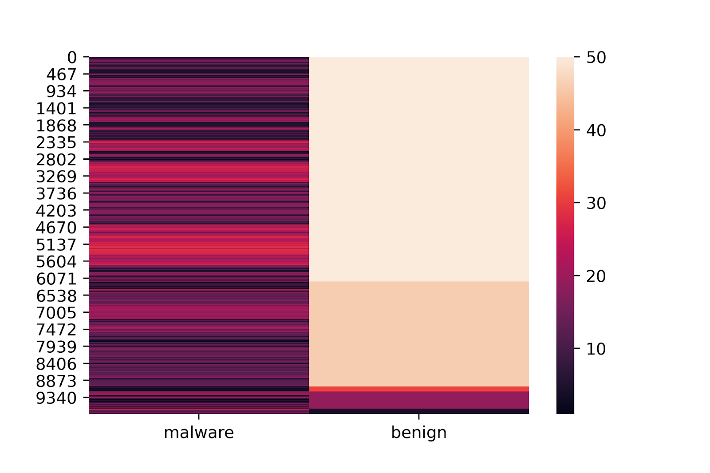

## 2. Data Exploration
### Data Source

  

The applications from the Android Play Store are reduced to a version of assembly code for Java-based applications called Dalvik bytecode. The APK’s that contain the smali code are directly downloaded from ‘https://apkpure.com/’ and compiled into .smali files using the apktools library. Thus, this data is then unpackaged using the apktools library that allows us to view the subsequent smali code (a code that humans can interpret) and app binaries. The smali code and app binaries contain a lot of the information derived from the Java source code that allows us to map the number of API calls and the relationships between them. 

### Data Categories 

We extracted the datasets of the source code of each app from our section resource, which includes a total of 800 apps. The benign apps are picked randomly. For the malware apps, we specifically picked malware apps that are type Anup and RuMMS. 

RuMMS is a type of SMS Phishing malware that has gained popularity in recent years, while some of the others were chosen randomly from a set of Malware types. The intention behind this was to accurately identify through embeddings the presence of varied Malware genres.

### Exploring Data 
#### Scale
The scale at which each application had API calls was approximate of the order of O(N2). Thus across a large variety of applications, there were approximately 10 Million API Calls that needed to be handled. To correctly evaluate the scale the APIs were analyzed at scale, some of these findings resulted in resorting to Vectorization and API Reduction techniques. 

The API call itself provides an array of information to be able to organize the relationships between APIs and Applications in their respective matrices. 
This is an example API call we extract and the following figure is how it is organized. 

Invoke−virtual {v2}, Ljava / lang / Process ;−> getInputStream ( ) Ljava/io/InputStream
Invoke Type		API Library		API NAME		Return Type

  

#### API Calls

One of the major differences between malware and benign apps is the number of API calls to the system. Not only are the number of API calls different, although the variety of API calls in malware tend to be much higher. 

Below we see the quantity distribution of the most popular common API across both Malware and Benign Applications. The commonly used API calls in benign apps tend to be similar. This further allows us to create better formulas for reducing and vectorizing API calls.

  

#### Constructing Adjacency Matrices
To help highlight APP → API relationships, we created 3 adjacency matrices. 
Below are the three matrices and their contents. 

  

Based on the matrices, we explored meta path AA^T, ABA^T, APA^T, and APBP^TA^T, and used multi-kernel learning to compute the similarities.

### Reduceing API Calls

For the project, we tested reducing the API’s used from the maximum value of 3 Million to 50,000 and then to 12,000; without sacrificing accuracy of the models ahead. 

### Benchmark Model 

As a baseline model for all the subsequent research, we picked the HinDroid model. The HinDroid model leverages the Adjacency Matrices and their subsequent meta paths, as outlined above to be inputted into Support Vector Machines as custom kernels for the model. 

### Benchmark Performance
| Meta-Path Walks | Walk Length | Accuracy |
| -- | -- | -- |
| AA^T  | 0.985218 | 0.97 |
| ABA^T  | 0.773315  | 0.77 |
| APA^T | 0.983132 | 0.97 |
| APBP^TA^T | 0.764901 | 0.77 |