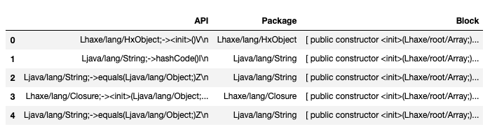
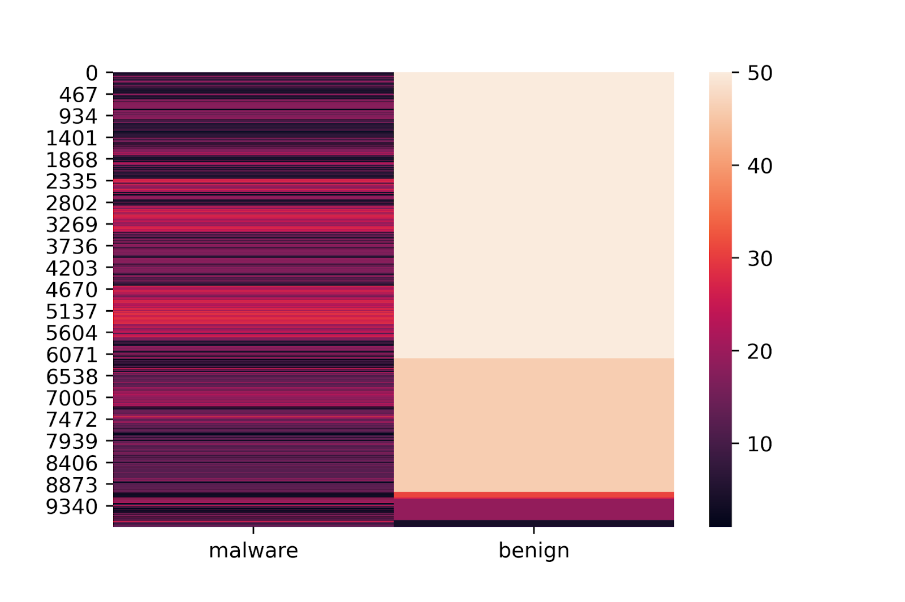
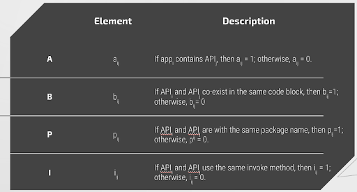
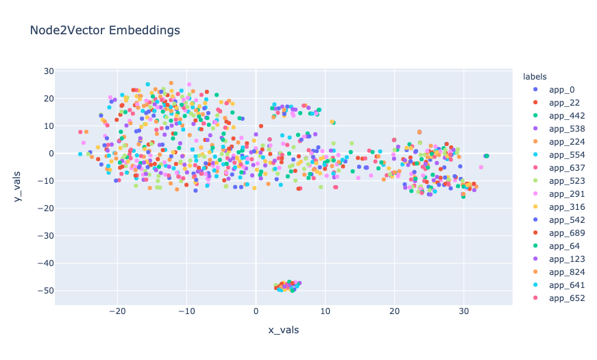

## Abstract

The Android app store and its open-source features make it extremely vulnerable to malicious software, known as Malware. The current state of the art encompasses the use of advanced code analysis and corresponding machine learning models. Although along with our initial research we found that the Applications in the Android app store along with their corresponding API calls behave a lot like a language. They have their comparable own syntax, structure, and grammar. This inspired us to use techniques from Natural Language Processing(NLP) and use the same idea of creating graphical relationships between applications and APIs. Additionally, we also show that the use of these graphical embeddings maintains the integrity of classification metrics to even correctly identify and differentiate Malware and Benign applications. 

## 1. Introduction 
 
By July 2020, Android OS is still a leading mobile operating system that holds 74.6% of the market share worldwide, attracting numerous cyber-criminals who are targeting the largest crowd. The current state of the art of Malware detection uses machine learning models built of static syntactic relationships between the codebase and corresponding API calls. 

A great baseline for models currently used is the HinDroid implementation. As other malware detection system simply use Application Programming Interface (API) calls, HinDroid further analyzes the relationship between API calls and higher-level semantics which raise the threshold for attackers. A prime example of using Heterogeneous Information Network for Android Malware Detection.

Initial analysis and research from the Heterogeneous Networks made it more apparent that the relationships between APIs and applications were closely modeled to languages. They had their own syntax, structure, and semantics. Thus these relationships were further analyzed in order to use Natural Language Processing (NLP) techniques to further form relationships and classify Malware and Benign applications. 

With the core idea to map out relationships using language models, this paper explores a handful of vectorization and embedding techniques to accurately form information chains across the data. In particular, we explore Word2vec, Node2vec, and Metapath2vec in-depth and discuss other advanced implementations. 

## 2. Data Exploration
### Data Source

In order to accurately map relationships between API’s the applications from the Android Play Store are reduced to a version of assembly code for Java-based applications called Dalvik bytecode. The APK’s that contain the smali code are directly downloaded from ‘https://apkpure.com/’ and compiled into .smali files using the apktools library.

### Data Extraction

Thus, this data is then unpackaged using the apktools library that allows us to view the subsequent smali code (a code that humans can interpret) and app binaries. The smali code and app binaries contain a lot of the information derived from the Java source code that allows us to map the number of API calls and the relationships between them. 

### Data Categories 

We extracted the datasets of the source code of each app from our section resource, which includes a total of 800 apps. The benign apps are picked randomly. For the malware apps, we specifically picked malware apps that are type Anup and RuMMS. 

RuMMS is a type of SMS Phishing malware that has gained popularity in recent years, while some of the others were chosen randomly from a set of Malware types. The intention behind this was to accurately identify through embeddings the presence of varied Malware genres.

### Exploring Data 
#### Scale
The scale at which each application had API calls was approximate of the order of O(N2). Thus across a large variety of applications, there were approximately 10 Million API Calls that needed to be handled. To correctly evaluate the scale the APIs were analyzed at scale, some of these findings resulted in resorting to Vectorization and API Reduction techniques. 

The API call itself provides an array of information to be able to organize the relationships between APIs and Applications in their respective matrices. 

#### API Calls

One of the major differences between malware and benign apps is the number of API calls to the system. Not only are the number of API calls different, although the variety of API calls in malware tend to be much higher. 
Below we see the quantity distribution of the most popular common API across both Malware and Benign Applications. The commonly used API calls in benign apps tend to be similar. This further allows us to create better formulas for reducing and vectorizing API calls.

#### Constructing Adjacency Matrices
To help highlight APP → API relationships, we created 3 adjacency matrices. 
Below are the three matrices and their contents. 

Based on the matrices, we explored meta path AA^T, ABA^T, APA^T, and APBP^TA^T, and used multi-kernel learning to compute the similarities.

### Baseline Model 

As a baseline model for all the subsequent research, we picked the HinDroid model. The HinDroid model leverages the Adjacency Matrices and their subsequent meta paths, as outlined above to be inputted into Support Vector Machines as custom kernels for the model. 
It must be noted that the baseline model, here, is not a function of improving subsequent models - rather a comparison to gauge metrics from various techniques used ahead.
### Baseline Performance
(table)
#### Data Considerations

The data was obtained through open source technologies and through random sampling, thus the analysis is the only representative of the sample quality. The number of apps and corresponding API calls does achieve the ability to scale thus eliminating any statistical biases in analysis or conclusions. 

## 3. Graph Embedding Techniques
Now that we’ve established base relationships across Apps and APIs through various adjacency matrices and baseline models. To better understand the relationships between API calls, and their subsequent properties we explore them through Graph Networks, their ability to learn and traverse, and the corresponding vectorized embeddings. 

### 3.1 Word2vec:
#### Introduction - 

Word2Vec is one of the most popular techniques to learn word embeddings using a shallow neural network, developed by Tomas Mikolov in 2013 at Google.  Word2vec learns the association among words from a large corpus of text, and it could be used to find synonymous words or suggest an additional word for an incomplete sentence using Skip Gram or Common Bag Of Words (CBOW).

#### Implementation - 

For this particular analysis, we constructed a graph traversal for the word to vector embeddings using the APA relationship. An APA relationship is a meta-path: App→(contains)API→(same package name)API→(contains-1)APP. After this, we can then use the dot product to calculate the similarity. This allows us to analyze through embeddings the relationships of malware and benign applications. This relationship is expressed as embeddings which we then visualize on the 2-Dimensional plane to further use clustering techniques to classify the application types.

#### Analysis - 
A large quantity of trial and error along with experimental methods allowed us to fine-tune the hyperparameters for the model. 
Walk Length - We found the walk length to be integral to correctly chain the right number of API relationships for the vocabulary corresponding to each application. With an initial walk length of 20, we found little to no success in unsupervised clustering techniques nor in the model accuracy of using the train and test matrices for predicting malware and benign apps from the corresponding API vector embeddings. While with a walk length of 100, higher accuracies were achieved and greater cluster analysis beyond the inference from the default k-means centroid. 

Choice of Meta Path - Through experimentation we found disparate predictive accuracies and correlated classification scores through different meta-paths to form chains of APP → API relationships. For this particular subset of applications and given the equal class balance of benign apps to malware applications we found the meta paths APA and APBPA gave us the closest performance to the performance benchmark of HinDroid. The first visualization of vector embeddings is using the APA meta_path and a longer walk length, while the second one is using APBPA and a shorter walk length. Although using APA and a longer walk length resulted in the highest accuracies for our training and testings set. 

Below we see an unsupervised k-means classification into clusters of the APA and APBPA walks respectively. 

This will display the three images side by side if the images are not too wide.

  
   

| Meta-Path Walks | Walk Length | Accuracy | F1 Score |
| -- | --| - | -- |
| APA  | 100 | 95% | 0.94 |
| APA  | 20  | 87% | 0.78 |
| APBPA | 100 | 91% | 0.93 |
| APBPA | 20 | 83% | 0.82 |

Below we see the 2D representation of the vector embeddings with the benign and malware classes being differentiated. 

### 3.2 Node2Vec:
#### Introduction - 

Node2vec is an algorithmic framework for representational learning on graphs. Given any graph, it can learn continuous feature representations for the nodes, which can then be used for various downstream machine learning tasks.
Compared to the simple graph we have for Word2Vec, Node2vec can be applied to complexly structured graphs that are " (un)directed, (un)weighted, or (a)cyclic." To accomplish that, Node2vec generates biased random walks from each node of the graph. This provides a way of balancing the exploration-exploitation tradeoff by smoothly interpolating between BFS and DFS.

#### Implementation -

Using random walks through the corpus, we created multiple documents as an input into the Gensim model for vectorizing embeddings using sentences. These embeddings were then analyzed using their corresponding graph clusters. 

The purpose of random walks is to add context to the Application → API nodes, by looking at corresponding applications or APIs that are neighbors to the starting applications. 

In the figure under node2vec above we clearly see the distinction between the two classes. On visualizing this on a 2-Dimensional plane it is now possible to use lighter classification models to help classify benign vs malware applications.

#### Analysis - 

Similar to node2vec, a distinct number of hyperparameters and model choices influenced the project. 

The following are a few hyperparameters that had a large impact on the performance of the model - 
 - Walk length: The count of nodes in each random walk 
 - P: Return hyperparameter - controlling the probability of going back to a previous node
 - Q: Input hyperparameter - controlling the probability to traverse to undiscovered parts of the graph 

For node2vec, these parameters above greatly influence the sampling strategy and how specific they’re intended to be.

Since the risk factor for misclassifying a malware app as benign is considerably high, we started testing the model and embeddings with a lower probability of backtracking or exploring different parts of the graph. Thus the window size of 2 and 1 respectively. 
 
On running the model and creating sentences the graph below shows the distribution of each app from a 2D representation of the graph embeddings. A point represents an app in the graph.

Then we use k-means clustering method to classify the apps from malware to benign apps. The graph below shows the result when k = 2, k=3, and k=4.(see pics below)

  
   
   

Here is the accurate plot differentiating malware from benign apps:

 

Comparing the plots, we can see that k-means clustering provides insight into the natural clusters of the graph. As all the k-means clustering separates clusters horizontally, we can assume that more than 50% of APPs are misclassified. Misclassifying malware as a benign app could cause a huge loss, so K-means clustering isn’t a good algorithm for detecting malware.

Looking at the second graph, we see a distinct boundary between the application types. Further analysis would look at different meta paths that could better identify this boundary in addition to classifiers to elevate the creation of decision boundaries.
Performance of Node2Vec embeddings on pre embedding data - 

(table)

A similar observation can be made with the word2vec graph showing the difference between the two classes, here even a linear relationship could be identified between the two classes.  

### 3.3 Metapath2vec
#### Introduction - 

Compared to Word2Vec and Node2Vec which use homogeneous graph networks, Metapath2Vec uses heterogeneous graph networks. Heterogeneous graph networks allow us to distinguish different types of nodes and edges(relationship). In our case, using heterogeneous graph networks enable us to see the difference between API and APP nodes. 

On the other hand, similar to Node2Vec, Metapath2Vec takes random walks to “construct the heterogeneous neighborhood of a node” and then uses “a heterogeneous skip-gram model to perform node embeddings.”

#### Implementation - 

We leveraged decisions based on the analysis from previous models for metapath2vec, allowing us to focus on scalability and the versatility of the model.

#### Analysis - 
(todo)

## 4. Future Research
There are multiple graph embedding models and techniques that go far beyond the ones explored today. Additionally, the scalability and ability to hyper optimize these embeddings their corresponding models exist to a large degree. 
Additionally, the research of adversarial models through the lens of Graph Embeddings allows a whole new aspect of risk and exploration. 

## 5. Conclusion

Overall, with a balance between feasibility of scaling and implementation, we found Node2vec most versatile, allowing us to retain accurate results while forming sentences and correlations that more closely represented the class division of applications.
It is often easy to forget while analyzing and writing code, that at the end of it all it’s still a language. Using technology and models designed for linguistic semantics and structure and using it on the binaries of a programming language and application is a meta-analysis that adequately serves its purpose. 

