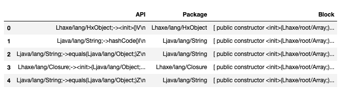

## Abstract

The Android app store and its open source features make it extremely vulnerable to malicious software, known as Malware. The current state of the art encompasses the use of advanced code analysis and corresponding machine learning models. Although along our initial research we found that the Applications in the Android app store along with their corresponding API calls behave a lot like a language.They have their comparable own syntax, structure and grammar. This inspired us to use techniques from Natural Language Processing(NLP) and use the same idea of creating graphical relationships between applications and api's. Additionally, we also show that the use of these graphical embeddings maintains the integrity of classification metrics to even correctly identify and differential Malware and Benign applications. 

## 1. Introduction 
 
By July 2020, Android OS is still a leading mobile operating system that holds 74.6% of the market share worldwide, attracting numerous cyber-criminals who are targeting the largest crowd.¹ The current state of the art of Malware detection uses machine learning models built of static syntactic relationships between the codebase and corresponding API calls. 

A great baseline for models currently used is the Hindroid implementation. As other malware detection system simply use Application Programming Interface (API) calls, HinDroid further analyzes the relationship between API calls and higher-level semantics which raise the threshold for attackers.3 A prime example of using Heterogeneous Information Network for Android Malware Detection.3

Initial analysis and research from the Heterogeneous Networks made it more apparent that the relationships between API’s and applications were closely modelled to languages. They had their own syntax, structure and semantics. Thus these relationships were further analyzed in order to use Natural Language Processing (NLP) techniques to further form relationships and classify Malware and Benign applications. 

With the core idea to map out relationships using language models this paper explores a handful of vectorization and embedding techniques to accurately form information chains across the data. In particular, we explore Word2vec, Node2vec and Metapath2vec in depth and discuss other advanced implementations. 

## 2. Data Exploration
### 2.1 Data Collection
#### Data Source
In order to accurately map relationships between API’s the applications from the Android Play Store are reduced to a version of assembly code for Java based applications called Dalvik bytecode. The APK’s that contain the smali code are directly downloaded from ‘https://apkpure.com/’ and compiled into .Smali files using the apktools library.

#### Data Extraction
Thus, this data is then unpackaged using the apktools library that allows us to view the subsequent smali code (a code that humans can interpret) and app binaries. The smali code and app binaries contain a lot of the information derived from the Java source code that allows us to map the number of API calls and the relationships between them. 

#### Data Categories 
We extracted the datasets of the source code of each app from our section resource, which includes a total of 800 apps. The benign apps are picked randomly. For the malware apps, we specifically picked malware apps that are type Anup and RuMMS. 

RuMMS is a type of SMS Phishing malware that has gained popularity in recent years, while some of the others were chosen randomly from a set of Malware types. The intention behind this was to accurately identify through embeddings the presence of varied Malware genres.

### 2.2 Exploring Data 
The scale at which each application had API calls was approximately of the order of O(N2). Thus across a large variety of applications there were approximately 24 Million API Calls that needed to be handled. To correctly evaluate the scale the API’s were analyzed at scale, some of these findings resulted in resorting to Vectorization and API Reduction techniques. 

The API call itself provides an array of information to be able to organize the relationships between API’s and Applications in their respective matrices. 

#### Constructing Adjacency Matrices
To help highlight APP → API relationships, we created 3 adjacency matrices. 
Below are the three matrices and their contents. 

(pic)

Based on the matrices, we explored meta path AA^T, ABA^T, APA^T, and APBP^TA^T, and used multi-kernel learning to compute the similarities.

## 3. Vector Embedding Analysis and Exploration
To visualize the Embedding Techniques, 
1. we imported gensim.models.keyedvectors to vectorize the apps
2. Then we visualize the high-dimension vector using scipy.TSNE, which allowed us to reduce the dimension of the vector embeddings to 2. So, we can visualize the vectors in a 2-D graph.
3. (For further work, we are going to explore if we can successfully classify benign apps and malware apps from the embedding vectors using SVM models.)

### 3.1 Word2vec:
（pic)
### 3.2 Node2Vec:
(pic)
The graph above shows the distribution of each app from graph embedding. A dot represents an app in the graph
Then we use k-means clustering method to classify the apps from malware to benign apps. The graph below shows the result when k = 2, k=3, and k=4.(see pics below)

(pic)
Here is the accurate plot differentiating malware from benign apps:
(pic)

Comparing the plots, we can see that k-means clustering isn’t a good model to predict the malware. As all the k-means clustering separates clusters horizontally, we can assume that more than 50% APPs are misclassified. Misclassifying a malware as a benign app could cause huge loss, so K-means clustering isn’t a good algorithm for detecting malware.

Looking at the second graph, we see a distinct boundary between the application types. Further analysis would look at different meta paths that could better identify this boundary in addition to classifiers to elevate the creation of decision boundaries.

A similar observation can be made with the word2vec graph showing the difference between the two classes, here even a linear relationship could be identified between the two classes. 

## 4. Graph Embedding Techniques

It becomes interesting to see how each techniques performs on the tasks of predicting the malware. Thus, we used different models to perform the task on the same datasets and meta-paths. Finally, we compared the results and to see which model is the best to use in different circumstances.

### 4.1 Word2Vec
Word2Vec is one of the most popular techniques to learn word embeddings using a shallow neural network, developed by Tomas Mikolov in 2013 at Google.  Word2vec learns the association among words from a large corpus of text, and it could be used to find synonymous words or suggest an additional word for an incomplete sentence using Skip Gram or Common Bag Of Words (CBOW).

For this particular analysis, we constructed a graph traversal for the word to vector embeddings using the APA relationship. An APA relationship is a meta-path: App→(contains)API→(same package name)API→(contains-1)APP. In this relationship, we are not only calculating the similarity of APIs between 2 APPs, but also calculating if the APIs are from the same package. After this, we can then use the dot product to calculate the similarity.

It’s is connecting an application and api in addition to the api calls that occur in similar packages and their corresponding applications. This allows us to pierce through the relationships of malware and benign applications. 

This relationship is expressed as embeddings which we then visualize on the 2-Dimensional plane to further use clustering techniques to classify the application types. 

### 4.2 Node2Vec
Node2vec is an algorithmic framework for representational learning on graphs. Given any graph, it can learn continuous feature representations for the nodes, which can then be used for various downstream machine learning tasks.

Compared to the simple graph we have for Word2Vec, Node2vec can be applied to complexly structured graphs that are " (un)directed, (un)weighted, or (a)cyclic." In order to accomplish that, Node2vec generates biased random walks from each node of the graph. This provides a way of balancing the exploration-exploitation tradeoff by smoothly interpolate between BFS and DFS.

Using random walks through the corpus, we created multiple documents as an input into the Gensim model for vectorizing embeddings using sentences. These embeddings were then analyzed using their corresponding graph clusters. 
The purpose of random walks are to add context to the Application → API nodes, by looking at corresponding applications or API’s that are neighbors to the starting applications. 

In the figure under node2vec above we clearly see the distinction between the two classes. On visualizing this on a 2-Dimensional plane it is now possible to use lighter classification models to help classify benign vs malware applications.

### 4.3 Metapath2Vec
Comparing to Word2Vec and Node2Vec which use homogeneous graph networks, Metapath2Vec uses heterogeneous graph networks. Heterogeneous graph networks allow us to distinguish different types of nodes and edges(relationship). In our case, using heterogeneous graph networks enable us to see the difference between API and APP nodes. 

On the other hand, similar to Node2Vec, Metapath2Vec takes random walks to “construct the heterogeneous neighborhood of a node” and then uses “a heterogeneous skip-gram model to perform node embeddings.”6 

## 5. Comparison
## 6. Conclusion

