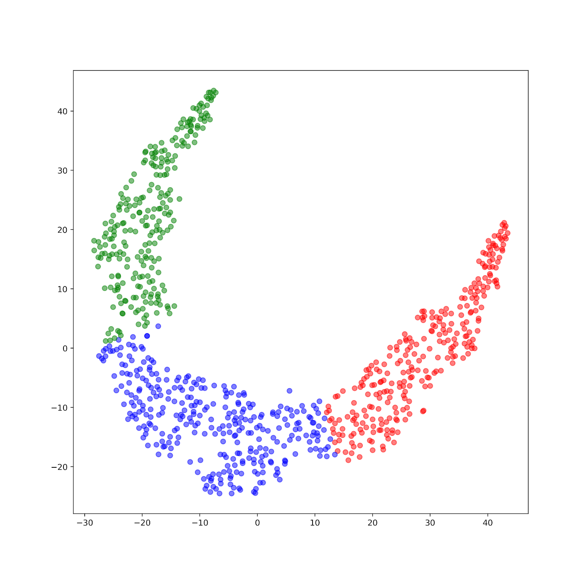
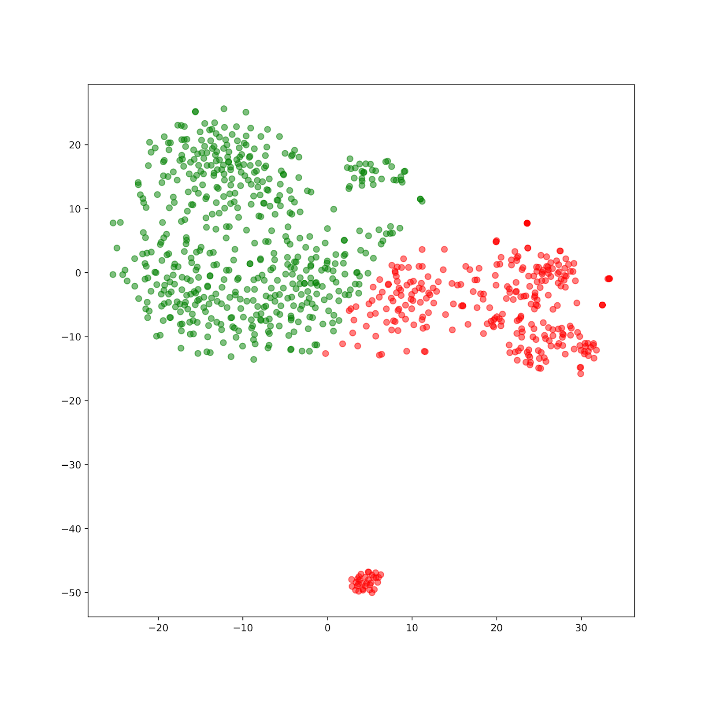
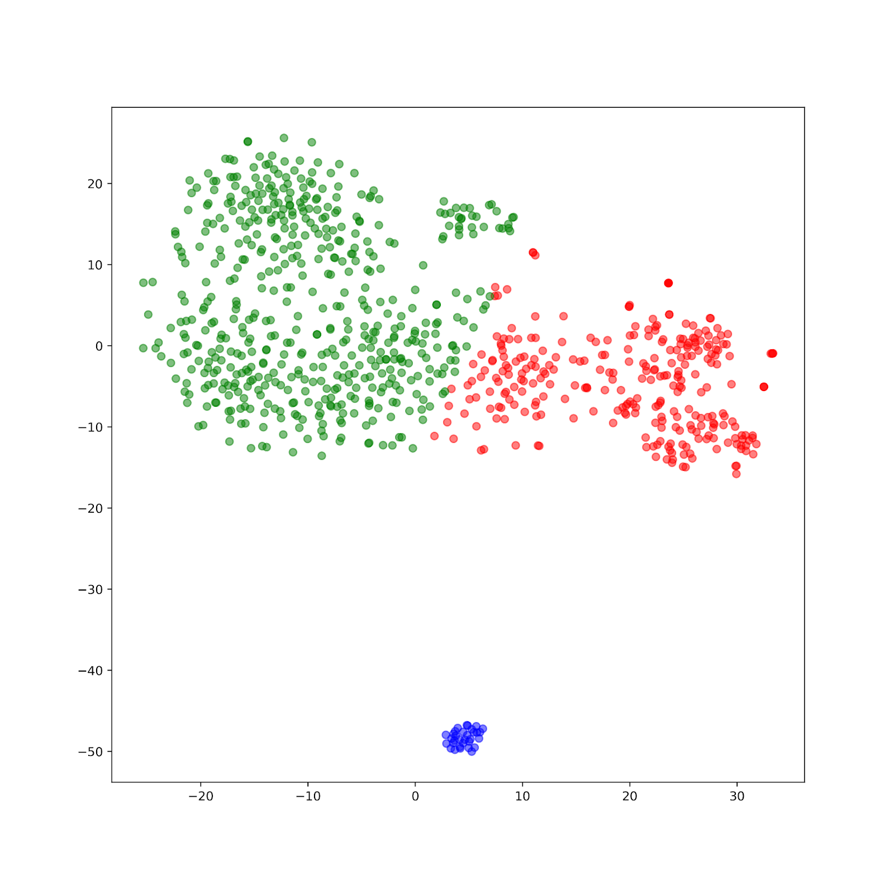
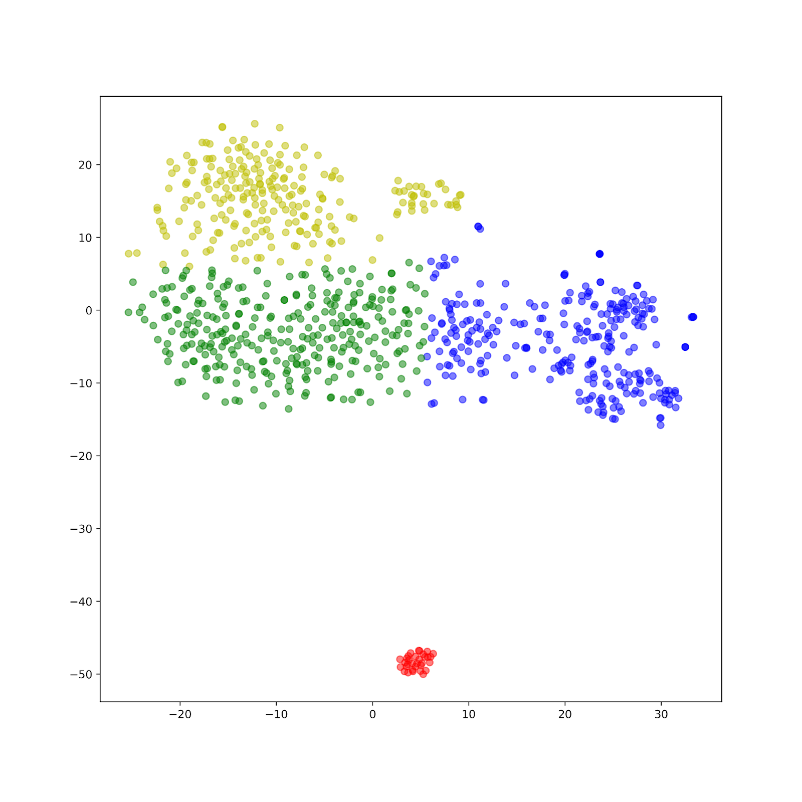
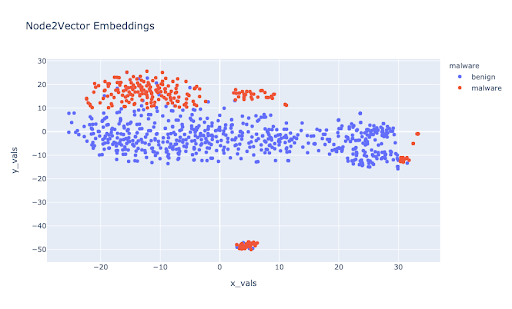

 ## 1. Introduction 
 
Are you using a Samsng, Huawei or Google phone? Are you aware that your phone is 50 times more likely to be hacked than an iphone which uses and IOS system? By July 2020, Android OS is still a leading mobile operating system that holds 74.6% of the market share worldwide, attracting numerous cyber-criminals who are targeting the largest crowd. Thus, developing a strong malware detection system becomes the number one priority.

  

The current state of the art of Malware detection uses machine learning models built of static syntactic relationships between the codebase and corresponding API calls. 

## 2. Data Exploration
### Data Source

The applications from the Android Play Store are reduced to a version of assembly code for Java-based applications called Dalvik bytecode. The APK’s that contain the smali code are directly downloaded from ‘https://apkpure.com/’ and compiled into .smali files using the apktools library. Thus, this data is then unpackaged using the apktools library that allows us to view the subsequent smali code (a code that humans can interpret) and app binaries. The smali code and app binaries contain a lot of the information derived from the Java source code that allows us to map the number of API calls and the relationships between them. 

### Data Categories 

We extracted the datasets of the source code of each app from our section resource, which includes a total of 800 apps. The benign apps are picked randomly. For the malware apps, we specifically picked malware apps that are type Anup and RuMMS. 

RuMMS is a type of SMS Phishing malware that has gained popularity in recent years, while some of the others were chosen randomly from a set of Malware types. The intention behind this was to accurately identify through embeddings the presence of varied Malware genres.

### Exploring Data 
#### Scale
The scale at which each application had API calls was approximate of the order of O(N2). Thus across a large variety of applications, there were approximately 10 Million API Calls that needed to be handled. To correctly evaluate the scale the APIs were analyzed at scale, some of these findings resulted in resorting to Vectorization and API Reduction techniques. 

The API call itself provides an array of information to be able to organize the relationships between APIs and Applications in their respective matrices. 
This is an example API call we extract and the following figure is how it is organized. 

Invoke−virtual {v2}, Ljava / lang / Process ;−> getInputStream ( ) Ljava/io/InputStream
Invoke Type		API Library		API NAME		Return Type

#### API Calls

One of the major differences between malware and benign apps is the number of API calls to the system. Not only are the number of API calls different, although the variety of API calls in malware tend to be much higher. 

Below we see the quantity distribution of the most popular common API across both Malware and Benign Applications. The commonly used API calls in benign apps tend to be similar. This further allows us to create better formulas for reducing and vectorizing API calls.

#### Constructing Adjacency Matrices
To help highlight APP → API relationships, we created 3 adjacency matrices. 
Below are the three matrices and their contents. 

Based on the matrices, we explored meta path AA^T, ABA^T, APA^T, and APBP^TA^T, and used multi-kernel learning to compute the similarities.

### Reduceing API Calls

For the project, we tested reducing the API’s used from the maximum value of 3 Million to 50,000 and then to 12,000; without sacrificing accuracy of the models ahead. 

### Benchmark Model 

As a baseline model for all the subsequent research, we picked the HinDroid model. The HinDroid model leverages the Adjacency Matrices and their subsequent meta paths, as outlined above to be inputted into Support Vector Machines as custom kernels for the model. 

### Benchmark Performance
| Meta-Path Walks | Walk Length | Accuracy |
| -- | -- | -- |
| AA^T  | 0.985218 | 0.97 |
| ABA^T  | 0.773315  | 0.77 |
| APA^T | 0.983132 | 0.97 |
| APBP^TA^T | 0.764901 | 0.77 |

## 3. Graph Embedding Techniques
Now that we’ve established base relationships across Apps and APIs through various adjacency matrices and baseline models. To better understand the relationships between API calls, and their subsequent properties we explore them through Graph Networks, their ability to learn and traverse, and the corresponding vectorized embeddings. 

### 3.1 Word2vec:
#### Introduction - 

Word2Vec is one of the most popular techniques to learn word embeddings using a shallow neural network, developed by Tomas Mikolov in 2013 at Google.  Word2vec learns the association among words from a large corpus of text, and it could be used to find synonymous words or suggest an additional word for an incomplete sentence using Skip Gram or Common Bag Of Words (CBOW).

#### Implementation - 

For this particular analysis, we constructed a graph traversal for the word to vector embeddings using the APA relationship. An APA relationship is a meta-path: App→(contains)API→(same package name)API→(contains-1)APP. After this, we can then use the dot product to calculate the similarity. This allows us to analyze through embeddings the relationships of malware and benign applications. This relationship is expressed as embeddings which we then visualize on the 2-Dimensional plane to further use clustering techniques to classify the application types.

#### Analysis - 
A large quantity of trial and error along with experimental methods allowed us to fine-tune the hyperparameters for the model. 
Walk Length - We found the walk length to be integral to correctly chain the right number of API relationships for the vocabulary corresponding to each application. With an initial walk length of 20, we found little to no success in unsupervised clustering techniques nor in the model accuracy of using the train and test matrices for predicting malware and benign apps from the corresponding API vector embeddings. While with a walk length of 100, higher accuracies were achieved and greater cluster analysis beyond the inference from the default k-means centroid. 

Choice of Meta Path - Through experimentation we found disparate predictive accuracies and correlated classification scores through different meta-paths to form chains of APP → API relationships. For this particular subset of applications and given the equal class balance of benign apps to malware applications we found the meta paths APA and APBPA gave us the closest performance to the performance benchmark of HinDroid. The first visualization of vector embeddings is using the APA meta_path and a longer walk length, while the second one is using APBPA and a shorter walk length. Although using APA and a longer walk length resulted in the highest accuracies for our training and testings set. 

Below we see an unsupervised k-means classification into clusters of the APA and APBPA walks respectively. 

  
   

For the following downstream predictive tasks we used the embeddings and a Random Forest Classifier different train/test sets depending on the walk lengths and their corresponding embeddings.

| Meta-Path Walks | Walk Length | Accuracy | F1 Score |
| -- | --| - | -- |
| APA  | 100 | 95% | 0.94 |
| APA  | 20  | 87% | 0.78 |
| APBPA | 100 | 91% | 0.93 |
| APBPA | 20 | 83% | 0.82 |

Below we see the 2D representation of the vector embeddings with the benign and malware classes being differentiated. 

### 3.2 Node2Vec:
[Node2Vec](./w2v.html)
#### Introduction - 

Node2vec is an algorithmic framework for representational learning on graphs. Given any graph, it can learn continuous feature representations for the nodes, which can then be used for various downstream machine learning tasks.

Compared to the simple graph we have for Word2Vec, Node2vec can be applied to complexly structured graphs that are " (un)directed, (un)weighted, or (a)cyclic." To accomplish that, Node2vec generates biased random walks from each node of the graph. This provides a way of balancing the exploration-exploitation tradeoff by smoothly interpolating between BFS and DFS.

#### Implementation -

Using random walks through the corpus, we created multiple documents as an input into the Gensim model for vectorizing embeddings using sentences. These embeddings were then analyzed using their corresponding graph clusters. 

The purpose of random walks is to add context to the Application → API nodes, by looking at corresponding applications or APIs that are neighbors to the starting applications. 

In the figure under node2vec above we clearly see the distinction between the two classes. On visualizing this on a 2-Dimensional plane it is now possible to use lighter classification models to help classify benign vs malware applications.

#### Analysis - 

Similar to node2vec, a distinct number of hyperparameters and model choices influenced the project. 

The following are a few hyperparameters that had a large impact on the performance of the model - 
 - Walk length: The count of nodes in each random walk 
 - P: Return hyperparameter - controlling the probability of going back to a previous node
 - Q: Input hyperparameter - controlling the probability to traverse to undiscovered parts of the graph 

For node2vec, these parameters above greatly influence the sampling strategy and how specific they’re intended to be.

Since the risk factor for misclassifying a malware app as benign is considerably high, we started testing the model and embeddings with a lower probability of backtracking or exploring different parts of the graph. Thus the window size of 2 and 1 respectively. 
 
On running the model and creating sentences the graph below shows the distribution of each app from a 2D representation of the graph embeddings. A point represents an app in the graph.

Then we use k-means clustering method to classify the apps from malware to benign apps. The graph below shows the result when k = 2, k=3, and k=4.(see pics below)

  
   
   

Here is the accurate plot differentiating malware from benign apps:

 

Comparing the plots, we can see that k-means clustering provides insight into the natural clusters of the graph. As all the k-means clustering separates clusters horizontally, we can assume that more than 50% of APPs are misclassified. Misclassifying malware as a benign app could cause a huge loss, so K-means clustering isn’t a good algorithm for detecting malware.
Looking at the second graph, we see a distinct boundary between the application types. Further analysis would look at different meta paths that could better identify this boundary in addition to classifiers to elevate the creation of decision boundaries.

On evaluating multiple classification models for Node2vec we found that Support Vector Machines provided us with the optimal Accuracy and recall tradeoff. We used Support Vector machines with the radial bias function(RBF) kernel, along with a higher than default regularization constant of 5. 
Performance of Node2Vec embeddings using an SVC - 

|P| Q | Walk Length | Accuracy | F1 Score |
| -- | -- | --| -- | -- |
| 2 | 1 | 100 | 94% | 0.92 |
| 2 | 2 | 100 | 94% | 0.92 |
| 1 | 2 | 100 | 91% | 0.91 |
| 3 | 3 | 100 | 89% | 0.88 |

A similar observation can be made with the word2vec graph showing the difference between the two classes, here even a linear relationship could be identified between the two classes. 

### 3.3 Metapath2vec
#### Introduction - 

Compared to Word2Vec and Node2Vec which use homogeneous graph networks, Metapath2Vec uses heterogeneous graph networks. Heterogeneous graph networks allow us to distinguish different types of nodes and edges(relationship). In our case, using heterogeneous graph networks enable us to see the difference between API and APP nodes. 

On the other hand, similar to Node2Vec, Metapath2Vec takes random walks to “construct the heterogeneous neighborhood of a node” and then uses “a heterogeneous skip-gram model to perform node embeddings.”

#### Implementation - 

We leveraged decisions based on the analysis from previous models for metapath2vec, allowing us to focus on scalability and the versatility of the model.
Metapath2Vec unlike the previous models through heterogeneous walks is able to capture less biased data through chaining together multiple API’s. For the purpose of this research we focus on the native Metapath2Vec implementation and not it’s Metapath2Vec ++ implementation which adds negative sampling functionality.

For metapath2vec the implementation involved selecting a random application and finding a corresponding uniformly probable API that has been found in the application. Once this is found, we extract a corresponding API from the from the column where it is found in other applications. This process of moving through the matrices with App → API relationships allows us to create meta paths. 

#### Analysis - 
| Meta-Path Walks | Accuracy | F1 Score |
| -- | -- | -- |
| APA  | 94% | 0.95 |
| APA  | 91% | 0.91 |
| APBPA | 83% | 0.87 |

## 4. Future Research
### Shortcomings 

1. Primarily with the given resources and ability to scale, we reached our ability of applications and APIs we could have used. Ideally compared to a lot of academic research and papers, we would want to scale our dataset by a factor of 30 times. 

### Future Research 

Primarily, in our project - we have 3 graph embedding techniques that are analyzed through their embeddings and models. These models could be expanded to be neural networks or architectures that better help predict embeddings than the current classification models.

There are multiple graph embedding models and techniques that go far beyond the ones explored today. Additionally, the scalability and ability to hyper optimize these embeddings their corresponding models exist to a large degree. 

Additionally, the research of adversarial models through the lens of Graph Embeddings allows a whole new aspect of risk and exploration. 

## 5. Conclusion

Overall, with a balance between feasibility of scaling and implementation, we found Node2vec most versatile, allowing us to retain accurate results while forming sentences and correlations that more closely represented the class division of applications.
It is often easy to forget while analyzing and writing code, that at the end of it all it’s still a language. Using technology and models designed for linguistic semantics and structure and using it on the binaries of a programming language and application is a meta-analysis that adequately serves its purpose. 

