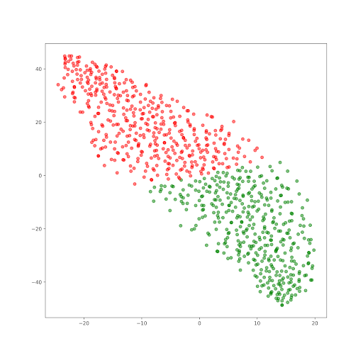
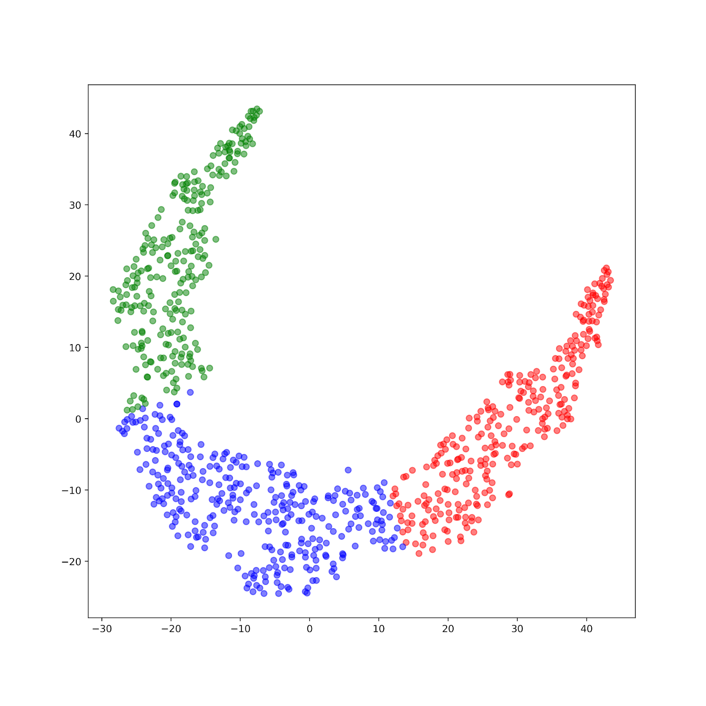
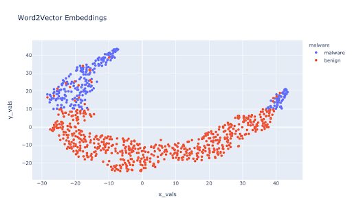

### 3.1 Word2vec:
#### Introduction - 

Word2Vec is one of the most popular techniques to learn word embeddings using a shallow neural network, developed by Tomas Mikolov in 2013 at Google.  Word2vec learns the association among words from a large corpus of text, and it could be used to find synonymous words or suggest an additional word for an incomplete sentence using Skip Gram or Common Bag Of Words (CBOW).

#### Implementation - 

For this particular analysis, we constructed a graph traversal for the word to vector embeddings using the APA relationship. An APA relationship is a meta-path: App→(contains)API→(same package name)API→(contains-1)APP. After this, we can then use the dot product to calculate the similarity. This allows us to analyze through embeddings the relationships of malware and benign applications. This relationship is expressed as embeddings which we then visualize on the 2-Dimensional plane to further use clustering techniques to classify the application types.

#### Analysis - 
A large quantity of trial and error along with experimental methods allowed us to fine-tune the hyperparameters for the model. 
Walk Length - We found the walk length to be integral to correctly chain the right number of API relationships for the vocabulary corresponding to each application. With an initial walk length of 20, we found little to no success in unsupervised clustering techniques nor in the model accuracy of using the train and test matrices for predicting malware and benign apps from the corresponding API vector embeddings. While with a walk length of 100, higher accuracies were achieved and greater cluster analysis beyond the inference from the default k-means centroid. 

Choice of Meta Path - Through experimentation we found disparate predictive accuracies and correlated classification scores through different meta-paths to form chains of APP → API relationships. For this particular subset of applications and given the equal class balance of benign apps to malware applications we found the meta paths APA and APBPA gave us the closest performance to the performance benchmark of HinDroid. The first visualization of vector embeddings is using the APA meta_path and a longer walk length, while the second one is using APBPA and a shorter walk length. Although using APA and a longer walk length resulted in the highest accuracies for our training and testings set. 

Below we see an unsupervised k-means classification into clusters of the APA and APBPA walks respectively. 

  
   

For the following downstream predictive tasks we used the embeddings and a Random Forest Classifier different train/test sets depending on the walk lengths and their corresponding embeddings.

| Meta-Path Walks | Walk Length | Accuracy | F1 Score |
| -- | --| - | -- |
| APA  | 100 | 95% | 0.94 |
| APA  | 20  | 87% | 0.78 |
| APBPA | 100 | 91% | 0.93 |
| APBPA | 20 | 83% | 0.82 |

Below we see the 2D representation of the vector embeddings with the benign and malware classes being differentiated. 

